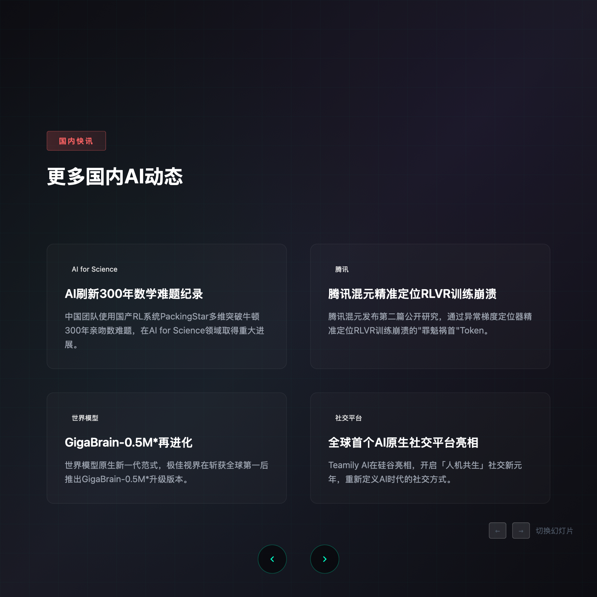
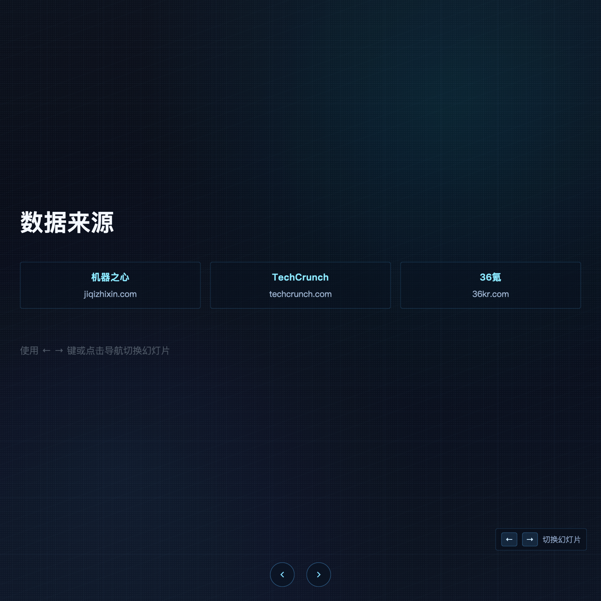

# web-vis

把信息快速渲染成网页讲义，用于演讲和汇报。

## 快速使用
```bash
git clone https://github.com/ShuiYidi/web-vis.git
cd web-vis
python3 -m http.server 8080
```

打开 `http://localhost:8080/ai-news-slides.html` 即可全屏演示。

## 效果预览




## 编辑入口
- 内容：`ai-news-slides.html` 中每个 `.slide` 区块
- 样式：同文件 `<style>` 区域
- 交互：同文件底部 `<script>`（左右键、按钮、滑动）

## 使用建议
- 每页只保留一个核心结论
- 关键信息优先，细节放口述
- 数据尽量标注来源
